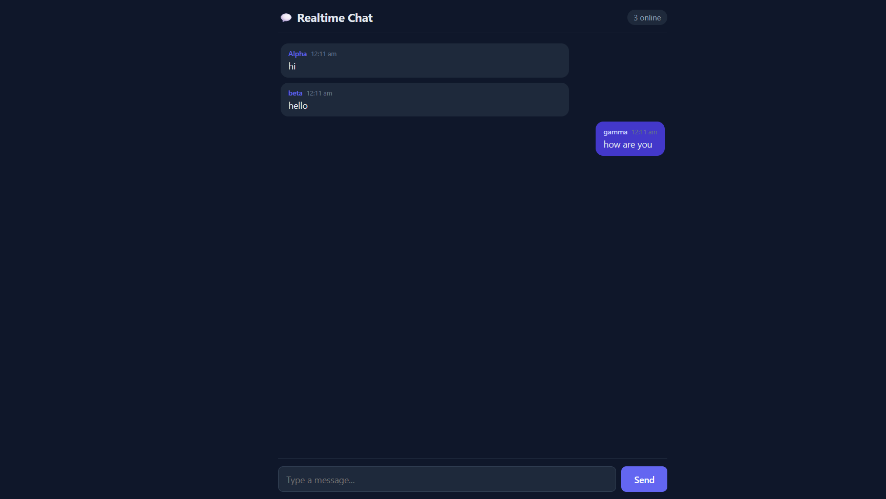

# 💬 Realtime Chat

A simple, real-time chat web app built with **Node.js**, **Express**, and **Socket.IO**. Multiple people can join from different browser tabs/devices and message each other instantly — no page refresh needed.

## Output


## Features

- Real-time messaging powered by WebSockets (Socket.IO)
- Choose a username when you join
- Live online-user count
- "User is typing..." indicator
- System messages when someone joins or leaves
- Clean, responsive dark-mode UI — works on desktop and mobile browsers

## Tech stack

- **Backend:** Node.js, Express, Socket.IO
- **Frontend:** Plain HTML/CSS/JavaScript (no framework, no build step)

## Project structure

```
realtime-chat/
├── server.js          # Express + Socket.IO server
├── package.json
└── public/
    ├── index.html      # Chat UI
    ├── style.css       # Styling
    └── app.js          # Client-side Socket.IO logic
```

## Getting started

### Prerequisites

- [Node.js](https://nodejs.org/) (v16 or later) installed on your machine

### Installation

```bash
# Clone the repo
git clone https://github.com/YOUR-USERNAME/realtime-chat.git
cd realtime-chat

# Install dependencies
npm install

# Start the server
npm start
```

The app will be running at **http://localhost:3000**.

### Try it out

1. Open http://localhost:3000 in your browser, enter a username, and join.
2. Open the same URL in a second tab (or on another device on the same network), join with a different username.
3. Send messages — they'll appear instantly in both windows.

## How it works

- The server (`server.js`) uses Express to serve the static frontend files and Socket.IO to handle real-time, bidirectional communication.
- When a user sends a message, the client emits a `chat message` event to the server, which broadcasts it to every connected client.
- Typing status and online user count are handled the same way, via lightweight custom Socket.IO events.

## Deploying it

Because it's just a small Node.js server, it deploys easily to services like Render, Railway, Fly.io, or a basic VPS. Set the `PORT` environment variable if your host requires it — the server already reads `process.env.PORT`.

## Ideas to extend it

- Persist chat history in a database (e.g. SQLite, MongoDB)
- Add chat rooms / channels
- Add private messaging between users
- Add user avatars or emoji reactions
